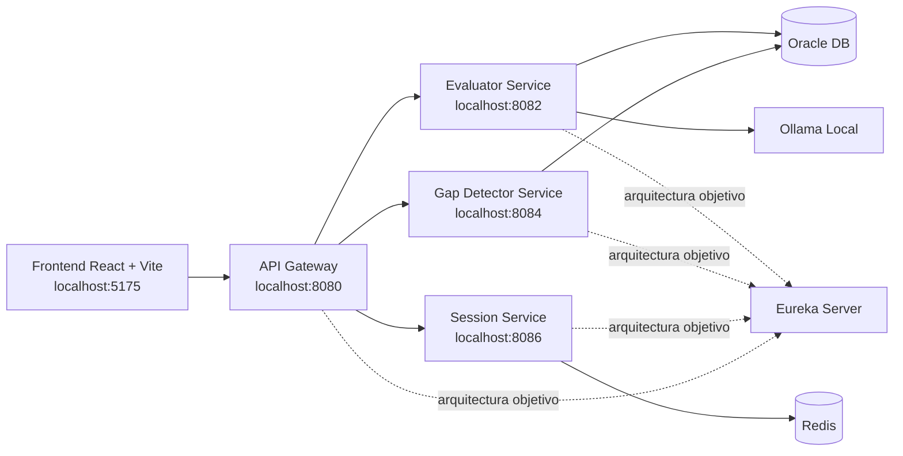

# Prompt Para Generar Documento Word De La Sesion De Trabajo De TutorBot Campus

Usa este prompt para generar un documento estilo Word, profesional y didactico, dirigido a alumnos universitarios, que explique de forma clara todo lo que se implemento y corrigio en la sesion de trabajo de hoy sobre el proyecto TutorBot Campus.

## Instruccion principal

Genera un documento completo, con estructura profesional tipo Word, pensado para alumnos de sexto semestre de una materia como Programacion Web, Arquitectura de Software o Desarrollo de Aplicaciones Empresariales. El documento debe explicar, de forma pedagogica pero tecnicamente precisa, todo lo que se hizo en la sesion de trabajo de hoy en el proyecto TutorBot Campus.

El objetivo del documento es que un alumno pueda entender:

- Que arquitectura tiene TutorBot Campus.
- Como se conectan frontend, gateway y microservicios.
- Que papel juega Eureka en la arquitectura general, aunque para el happy path local se hayan usado rutas directas sin discovery.
- Que servicios se tocaron, que endpoints se usaron, que problemas aparecieron y como se resolvieron.
- Como quedo funcionando el flujo completo login -> seleccion de tema -> chat -> evaluacion.
- Que aprendizajes de arquitectura, integracion, CORS, persistencia, contratos API y debugging deja esta sesion.

Escribe el documento en espanol. Usa un tono formal, claro y educativo. No lo redactes como minuta informal ni como changelog crudo. Debe leerse como material de clase o documento de apoyo para laboratorio/proyecto.

## Formato deseado del documento

Genera el contenido con formato pensado para exportarse a Word:

- Portada institucional.
- Titulo.
- Subtitulo.
- Tabla de contenido.
- Encabezados jerarquicos.
- Tablas donde ayuden a explicar puertos, servicios, APIs y responsabilidades.
- Bloques de codigo con formato limpio.
- Diagramas Mermaid cuando sea util.
- Listas numeradas para flujos.
- Recuadros de notas o advertencias usando texto como `Nota:` o `Importante:`.
- Espacios para capturas usando texto como `[Captura sugerida: ...]`.

## Datos del documento

- Proyecto: TutorBot Campus
- Institucion: Tecnologico de Monterrey
- Semestre: Sexto semestre
- Periodo: Febrero-Junio 2026
- Tipo de documento: Memoria tecnica y didactica de implementacion
- Audiencia: Alumnos universitarios
- Idioma: Espanol
- Enfoque: Explicativo, arquitectonico, practico y orientado a laboratorio

## Contexto general que el documento debe explicar

TutorBot Campus es una plataforma de tutoria academica basada en microservicios. Durante la sesion de trabajo se avanzo en la integracion de frontend y backend para dejar un happy path funcional localmente, sin depender de toda la infraestructura distribuida completa.

La arquitectura general contempla varios servicios:

- `eureka-server`: registro y descubrimiento de servicios.
- `api-gateway`: punto de entrada unico para el frontend.
- `evaluator-service`: evalua respuestas del alumno.
- `gap-detector-service`: detecta lagunas de aprendizaje.
- `session-service`: administra sesiones y mensajes del chat.
- Otros servicios del ecosistema, como `exercise-service`, `learning-path-service` y `notifier-service`, aunque no fueron el centro de esta sesion.

Tambien existen componentes de infraestructura:

- Oracle Database.
- Redis.
- Ollama como motor local de IA.
- Docker Compose para entorno local.

## Mensaje importante que debe quedar claro en el documento

Explica que Eureka forma parte de la arquitectura objetivo, pero para lograr el happy path local en esta sesion se opto por una estrategia de desarrollo simplificada:

- El frontend consume un `api-gateway` local en `http://localhost:8080`.
- El gateway enruta directamente a puertos locales de los servicios.
- Eureka se deshabilito para el flujo local de prueba.
- La seguridad del gateway se relajo localmente para permitir pruebas end-to-end.

Esto debe presentarse como una decision de desarrollo local, no como la arquitectura final de produccion.

## Secciones obligatorias del documento

El documento debe contener, como minimo, las siguientes secciones.

### 1. Introduccion

Explica que el trabajo de la sesion consistio en conectar un frontend React con una arquitectura de microservicios Java/Spring Boot, dejando un flujo feliz funcional de extremo a extremo.

### 2. Vision general de la arquitectura

Incluye un diagrama Mermaid o textual que muestre algo como esto:



Debes explicar cada pieza y distinguir entre:

- Arquitectura objetivo.
- Arquitectura local de desarrollo usada hoy.

### 3. Objetivos tecnicos de la sesion

Explica que durante esta sesion se busco:

- Implementar el frontend UI de TutorBot Campus en React.
- Conectar el frontend con backend real en lugar de depender solo de Claude en browser.
- Exponer login, topics, sessions y evaluations via gateway.
- Levantar servicios locales para probar el happy path.
- Resolver errores reales de integracion: base de datos, CORS, rutas del gateway, contrato API y estado inicial del chat.

### 4. Frontend construido e integrado

Describe que el frontend fue desarrollado en React + TypeScript + Vite y que se integraron o refactorizaron estas piezas:

- Rutas principales: `/login`, `/`, `/chat`, `/progress`.
- `AuthGuard` para proteger rutas autenticadas.
- `LoginPage` para autenticacion local.
- `TopicSelectPage` para elegir tema desde backend.
- `ChatPage` como flujo principal de tutoria.
- `ProgressPage` para analitica y leaderboard.
- `useSession` para persistencia de sesion y sincronizacion con backend.
- `useStreamingChat` para manejar historial, envio de mensajes, evaluacion y quizzes.
- `src/api/auth.ts`, `src/api/tutorbot.ts`, `src/api/sessions.ts` como clientes HTTP.

Explica que originalmente el chat dependia mas de Claude directamente desde el navegador, pero se migraron las interacciones principales a microservicios via gateway.

### 5. Microservicios y cambios realizados

Incluye una tabla con servicios, puertos y cambios relevantes:

| Servicio | Puerto | Cambio realizado en la sesion | Motivo |
|---|---:|---|---|
| api-gateway | 8080 | Se configuraron rutas locales y se simplifico seguridad | Permitir consumo centralizado desde el frontend |
| evaluator-service | 8082 | Se habilito topics endpoint, fallback de evaluacion y correcciones de arranque | Evaluar respuestas y proveer temas al frontend |
| gap-detector-service | 8084 | Se alineo config Oracle local | Compatibilidad con entorno local |
| session-service | 8086 | Se ampliaron endpoints para sesiones y mensajes | Mantener historial y estado del chat |
| eureka-server | variable | Se mantuvo como parte de la arquitectura general, pero no como dependencia del happy path local | Simplificar integracion local |

### 6. API Gateway y por que fue clave

Explica didacticamente:

- Que es un API Gateway.
- Por que el frontend no deberia llamar a todos los microservicios por separado.
- Como el gateway centraliza autenticacion, CORS y enrutamiento.

Detalla que en esta sesion se corrigieron dos puntos importantes:

1. La configuracion de rutas estaba usando una propiedad incorrecta y por eso devolvia `404`.
2. Las rutas debian aceptar tanto el path base como el path con wildcard, por ejemplo:
   - `/api/v1/topics`
   - `/api/v1/topics/**`

Explica tambien el problema de CORS:

- El frontend hacia login desde `http://localhost:5175`.
- El navegador enviaba un preflight `OPTIONS`.
- El gateway lo estaba rechazando con `403`.
- Se corrigio la configuracion de CORS en WebFlux para permitir origenes `localhost` y `127.0.0.1`.

### 7. Eureka en la arquitectura

Dedica una seccion especifica a Eureka. Explica:

- Que es Service Discovery.
- Como encaja Eureka en una arquitectura de microservicios.
- Que ventajas aporta en ambientes distribuidos.
- Por que en desarrollo local a veces se bypassa temporalmente para llegar mas rapido al happy path.

Deja muy claro que:

- Eureka no desaparece de la arquitectura.
- Simplemente se deshabilito en el flujo local de hoy para reducir friccion.

### 8. APIs y contratos usados

Incluye una tabla con los endpoints principales usados o creados durante la sesion:

| Endpoint | Metodo | Servicio real | Proposito |
|---|---|---|---|
| `/api/v1/auth/login` | POST | api-gateway | Login local para obtener token |
| `/api/v1/topics` | GET | evaluator-service via gateway | Cargar temas disponibles |
| `/api/v1/sessions` | POST | session-service via gateway | Crear sesion de estudio |
| `/api/v1/sessions/{sessionId}` | GET | session-service via gateway | Recuperar sesion |
| `/api/v1/sessions/{sessionId}` | PATCH | session-service via gateway | Actualizar nivel u otros datos |
| `/api/v1/sessions/{sessionId}/messages` | GET | session-service via gateway | Cargar historial del chat |
| `/api/v1/sessions/{sessionId}/messages` | POST | session-service via gateway | Persistir mensajes |
| `/api/v1/evaluations` | POST | evaluator-service via gateway | Evaluar respuesta del alumno |
| `/api/v1/gaps/student/{studentId}/latest` | GET | gap-detector-service via gateway | Obtener gap mas reciente |
| `/api/v1/gaps/leaderboard?topicId=...` | GET | gap-detector-service via gateway | Obtener leaderboard |

Explica el contrato importante de evaluacion:

- El frontend esperaba `feedback`.
- El backend devolvia `feedbackSummary`.
- Se corrigio el cliente frontend para normalizar esa respuesta.

### 9. Problemas reales encontrados y como se resolvieron

Esta seccion es obligatoria y debe escribirse como aprendizaje tecnico.

Incluye, como minimo, estos problemas:

#### 9.1 Error de Oracle `ORA-12514`

Explica que el datasource apuntaba a `TESTDB`, pero el contenedor realmente exponia `XEPDB1`. Aclara que se corrigio la URL JDBC de los perfiles dev en servicios relevantes.

#### 9.2 Dependencia de RabbitMQ en evaluator-service

Explica que `EvaluationEventPublisher` exigia `RabbitTemplate` aunque el entorno local no usaba mensajeria. Se hizo condicional con `tutorbot.messaging.enabled=true` para que el servicio arrancara sin RabbitMQ en desarrollo.

#### 9.3 Rutas 404 en el gateway

Explica la causa y la correccion del namespace de propiedades y los patrones `Path`.

#### 9.4 `Failed to fetch` en login

Explica que no era problema de React ni del formulario, sino del preflight CORS rechazado por el gateway.

#### 9.5 El chat respondia fuera de contexto

Explica que la sesion iniciaba sin mensaje del tutor y el primer texto del alumno se evaluaba como si ya existiera una pregunta previa. Se soluciono sembrando una pregunta inicial del tutor al arrancar una sesion vacia.

#### 9.6 El chat devolvia mensajes genericos fuera del tema

Explica que parte del flujo dependia de fallbacks del evaluator-service y de prompts genericos, por lo que se alineo mejor el contrato frontend-backend y el estado inicial del chat.

### 10. Flujo feliz final logrado

Explica paso por paso el flujo final:

1. El alumno entra al frontend.
2. Hace login con credenciales locales.
3. El frontend recibe token del gateway.
4. Se cargan los temas desde `GET /api/v1/topics`.
5. El alumno elige tema y nivel.
6. Se crea una sesion backend.
7. El chat siembra una primera pregunta del tutor.
8. El alumno responde.
9. El frontend manda la respuesta a `POST /api/v1/evaluations`.
10. El evaluator-service devuelve score y retroalimentacion.
11. El frontend persiste mensajes y actualiza la UI.
12. Eventualmente se pueden generar quizzes y consultar gaps.

Incluye una subseccion llamada `Happy path validado` donde se diga que se verifico exitosamente:

- Login.
- Topics.
- Session creation.
- Evaluation.
- Build del frontend.

### 11. Archivos clave modificados

Incluye una tabla con rutas relevantes y una explicacion resumida:

- `frontend/src/App.tsx`
- `frontend/src/hooks/useSession.ts`
- `frontend/src/hooks/useStreamingChat.ts`
- `frontend/src/api/auth.ts`
- `frontend/src/api/tutorbot.ts`
- `frontend/src/api/sessions.ts`
- `frontend/src/pages/LoginPage.tsx`
- `frontend/src/pages/TopicSelectPage.tsx`
- `frontend/src/pages/ChatPage.tsx`
- `frontend/src/pages/ProgressPage.tsx`
- `frontend/src/components/AuthGuard.tsx`
- `backend/api-gateway/src/main/resources/application.properties`
- `backend/api-gateway/src/main/java/com/tutorbot/apigateway/config/SecurityConfig.java`
- `backend/api-gateway/src/main/java/com/tutorbot/apigateway/controller/AuthController.java`
- `backend/session-service/src/main/java/com/tutorbot/session/controller/SessionController.java`
- `backend/session-service/src/main/java/com/tutorbot/session/service/SessionService.java`
- `backend/evaluator-service/src/main/resources/application-dev.properties`
- `backend/evaluator-service/src/main/java/com/tutorbot/evaluator/controller/TopicController.java`
- `backend/evaluator-service/src/main/java/com/tutorbot/evaluator/event/EvaluationEventPublisher.java`
- `backend/evaluator-service/src/main/java/com/tutorbot/evaluator/ollama/OllamaService.java`

### 12. Validaciones tecnicas realizadas

Debes mencionar que durante la sesion se validaron cosas como:

- `npm run build` en frontend.
- `mvn -q -DskipTests compile` en servicios Java.
- `curl` a endpoints del gateway.
- Verificacion de health endpoint.
- Verificacion de CORS con `OPTIONS` y `POST`.
- Confirmacion de filas sembradas en Oracle.

### 13. Lecciones para alumnos

Esta seccion debe estar escrita en tono reflexivo y docente. Explica aprendizajes como:

- Integrar sistemas casi nunca falla por una sola cosa; normalmente hay problemas de contrato, red, seguridad y datos al mismo tiempo.
- Un `404` en gateway no siempre significa que el endpoint no exista; a veces la ruta no esta registrada correctamente.
- Un `Failed to fetch` en frontend puede ser CORS y no necesariamente backend caido.
- En microservicios, el estado inicial del flujo importa mucho; un chat sin primer prompt rompe la semantica completa de la evaluacion.
- La arquitectura objetivo y la arquitectura local de desarrollo pueden diferir sin que eso sea una contradiccion.

### 14. Conclusiones

Concluye que la sesion no solo construyo pantallas o endpoints, sino que conecto una experiencia completa de usuario sobre una arquitectura distribuida realista, resolviendo problemas de integracion tipicos de sistemas empresariales.

### 15. Anexos

Incluye anexos opcionales con:

- Comandos usados.
- Ejemplos de payloads JSON.
- Capturas sugeridas.
- Lista de puertos.
- Posibles siguientes pasos.

## Datos tecnicos especificos que debes incorporar textualmente en el documento

Incluye estos datos concretos:

- Frontend: React + TypeScript + Vite.
- Frontend local: `http://localhost:5175`.
- API Gateway: `http://localhost:8080`.
- evaluator-service: puerto `8082`.
- gap-detector-service: puerto `8084`.
- session-service: puerto `8086`.
- Oracle: datasource local corregido a `jdbc:oracle:thin:@localhost:1522/XEPDB1`.
- Redis y Ollama levantados con Docker para desarrollo.
- Usuario semilla para happy path: `A00835001`.
- Login local de pruebas: password `test`.

## Ejemplos de payloads que el documento debe mostrar

Incluye ejemplos como estos dentro del documento:

### Login

```json
{
  "studentId": "A00835001",
  "password": "test"
}
```

### Crear sesion

```json
{
  "studentId": "A00835001",
  "topicId": 1,
  "topicName": "HTML y CSS",
  "skillLevel": "beginner"
}
```

### Evaluacion

```json
{
  "sessionId": "<session-id>",
  "studentId": "A00835001",
  "topicId": 1,
  "questionText": "Explain semantic HTML",
  "studentAnswer": "It uses meaningful tags",
  "correctAnswer": null,
  "maxScore": 100,
  "skillLevel": "beginner"
}
```

## Instrucciones de estilo para el modelo que genere el documento

- No escribas el resultado como bullets sueltos sin narrativa.
- No asumas que el lector ya conoce microservicios, API Gateway o Eureka.
- Explica cada concepto antes de usarlo en el caso concreto.
- Usa ejemplos concretos del proyecto.
- Cuando menciones un problema, explica causa, sintoma y solucion.
- Manten un equilibrio entre profundidad tecnica y claridad docente.
- No inventes pasos no realizados.
- Si mencionas una decision local de desarrollo, distingela claramente de una arquitectura de produccion.

## Entregable esperado

El resultado final debe ser un documento largo, bien estructurado, listo para copiarse a Word, con lenguaje profesional, contenido tecnico riguroso y enfoque pedagogico para alumnos.
